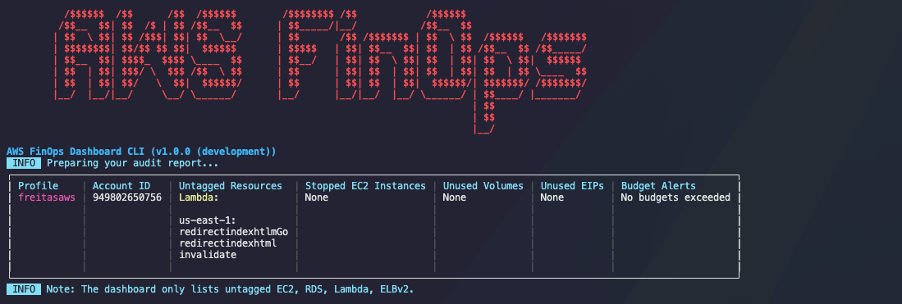

## Funcionamento Detalhado da CLI do AWS FinOps Dashboard
# AWS FinOps Dashboard CLI

### Prerequisitos
- Go 1.24 ou superior
- AWS CLI configurado com credenciais válidas
- Acesso à AWS Cost Explorer API
- Permissões adequadas para acessar os dados de custo e instâncias EC2


### AWS credentials com permissões:
```text
ce:GetCostAndUsage
budgets:DescribeBudgets
ec2:DescribeInstances
ec2:DescribeRegions
sts:GetCallerIdentity
```

### AWS credentials com permissões (para executar Audit report):
```text
ec2:DescribeInstances
ec2:DescribeVolumes
ec2:DescribeAddresses
budgets:DescribeBudgets
resourcegroupstaggingapi:GetResources
ec2:DescribeRegions
````

### Instalação
```bash
git clone https://github.com/diillson/aws-finops-dashboard-go.git

cd aws-finops-dashboard-go

make build
```

### Executando a CLI
Após o processo de build, o executável será gerado na pasta bin.
```path
./bin/aws-finops
```

### AWS CLI Profile Setup
Se você ainda não estiver configurado um perfil, configure seu nome de perfil usando AWS CLI será necessário para executar a CLI do AWS FinOps Dashboard.:
```text
aws configure --profile profile1-name
aws configure --profile profile2-name
... etc ...
```
Repetir para todos os perfil's que desejar usar na CLI.

Após relizar o build execute o script usando aws-finops com options:
```bash
aws-finops [options]
```

## 1. Arquitetura Geral

O AWS FinOps Dashboard segue uma arquitetura hexagonal (também conhecida como "portas e adaptadores") que separa claramente as responsabilidades:

### Principais Camadas:

• Domain: Contém as entidades e contratos de repositórios (interfaces)
• Application: Contém os casos de uso (lógica de negócio)
• Adapters: Implementa os repositórios (driven) e interfaces de usuário (driving)

### Componentes Principais:

-  cmd/aws-finops/main.go : Ponto de entrada da aplicação
-  internal/adapter/driving/cli : Implementação da interface de linha de comando
-  internal/application/usecase : Lógica de negócios principal
-  internal/adapter/driven/aws : Implementação do repositório AWS
-  pkg/console : Utilitários para saída no console

## 2. Fluxo de Execução

### 2.1. Inicialização da Aplicação

Quando o comando  aws-finops  é executado:

1. Bootstrap: Em  main.go :
```go
   func main() {
   // Inicializa o aplicativo CLI
   app := cli.NewCLIApp(version.Version)

   // Inicializa os repositórios
   awsRepo := aws.NewAWSRepository()
   exportRepo := export.NewExportRepository()
   configRepo := config.NewConfigRepository()
   consoleImpl := console.NewConsole()

   // Inicializa o caso de uso
   dashboardUseCase := usecase.NewDashboardUseCase(
   awsRepo,
   exportRepo,
   configRepo,
   consoleImpl,
   )

   // Define o caso de uso no aplicativo CLI
   app.SetDashboardUseCase(dashboardUseCase)

   // Executa o aplicativo
   if err := app.Execute(); err != nil {
   fmt.Fprintf(os.Stderr, "Error: %v\n", err)
   os.Exit(1)
   }
   }
```   

2. Criação do CLI App: O  cli.NewCLIApp  inicializa a aplicação CLI usando a biblioteca  cobra :
```go
   func NewCLIApp(versionStr string) *CLIApp {
   app := &CLIApp{
   version: versionStr,
   }

   // Configura o comando raiz
   rootCmd := &cobra.Command{
   Use:     "aws-finops",
   Short:   "AWS FinOps Dashboard CLI",
   Version: formattedVersion,
   RunE:    app.runCommand,
   }

   // Adiciona flags e opções de linha de comando
   rootCmd.PersistentFlags().StringP("config-file", "C", "", "...")
   rootCmd.PersistentFlags().StringSliceP("profiles", "p", nil, "...")
   // ... outras flags

   app.rootCmd = rootCmd
   return app
   }
```

### 2.2. Execução do Comando

Quando o comando é executado:

1. Exibição do Banner: O método  displayWelcomeBanner  exibe o banner ASCII colorido e a versão.
2. Verificação de Versão: A função  checkLatestVersion  é executada em uma goroutine para verificar se há atualizações sem bloquear a aplicação.
3. Análise de Argumentos: O método  parseArgs  converte os flags da linha de comando para um objeto  CLIArgs .
4. Execução do Dashboard: O caso de uso principal  dashboardUseCase.RunDashboard  é invocado com os argumentos analisados.

### 2.3. Execução do Caso de Uso  RunDashboard

O método  RunDashboard  do  DashboardUseCase  é o coração da aplicação:

1. Inicialização dos Perfis AWS:
   profilesToUse, userRegions, timeRange, err := uc.InitializeProfiles(args)
   Esta etapa determina quais perfis AWS serão usados, com base nas flags  --profiles ,  --all  ou usando o perfil default.
2. Escolha do Tipo de Relatório:
   - Se  --audit  for especificado, executa o método  RunAuditReport .
   - Se  --trend  for especificado, executa o método  RunTrendAnalysis .
   - Caso contrário, executa o dashboard principal de custos.
3. Para o Dashboard Principal:
   - Cria uma tabela para exibição.
   - Gera os dados para cada perfil AWS.
   - Exibe a tabela formatada.
   - Exporta relatórios se a flag  --report-name  for especificada.


## 3. Processamento de Perfis AWS

### 3.1. Processamento Individual de Perfil

Para cada perfil AWS especificado, o método  ProcessSingleProfile  ou  ProcessSingleProfileWithProgress :

1. Obtenção de Dados AWS:
   - Obtém ID da conta AWS.
   - Obtém dados de custo do Cost Explorer.
   - Determina regiões acessíveis.
   - Obtém resumo das instâncias EC2.
2. Processamento dos Dados:
   - Processa custos por serviço.
   - Formata informações de orçamento.
   - Formata resumo das instâncias EC2.
   - Calcula alteração percentual no custo total.
3. Exibição dos Dados:
   - Adiciona os dados formatados e coloridos à tabela.


### 3.2. Processamento Combinado (para a flag  --combine )

Quando a flag  --combine  é usada, os perfis que pertencem à mesma conta AWS são agrupados:

1. Agrupamento por Conta:
   for _, profile := range profilesToUse {
   accountID, err := uc.awsRepo.GetAccountID(ctx, profile)
   accountProfiles[accountID] = append(accountProfiles[accountID], profile)
   }

2. Processamento por Conta:
   Para cada conta, processa o perfil primário para obter dados de custo e EC2.

## 4. Tipos de Relatórios

### 4.1. Relatório de Custo (Padrão)

Exibe uma tabela com:
- Nome do perfil e ID da conta
- Custo do mês anterior
- Custo do mês atual com indicação de mudança percentual
- Custos detalhados por serviço
- Status do orçamento
- Resumo das instâncias EC2


### 4.2. Relatório de Auditoria (flag  --audit )

Exibe uma tabela com:
- Nome do perfil e ID da conta
- Recursos não marcados (untagged)
- Instâncias EC2 paradas
- Volumes EBS não utilizados
- IPs Elásticos não utilizados
- Alertas de orçamento


### 4.3. Análise de Tendência (flag  --trend )

Exibe gráficos de barras mostrando:
- Tendência de custos mensais por conta/perfil
- Alteração percentual mês a mês
- Visualização colorida para indicar aumento/diminuição


## 5. Exportação de Relatórios

Quando a flag  --report-name  é fornecida, a aplicação pode exportar os relatórios em vários formatos:

### 5.1. Formatos Suportados (flag  --report-type ):

- CSV: Tabela em formato de valores separados por vírgulas
- JSON: Representação estruturada em JSON
- PDF: Documento PDF formatado com tabelas

### 5.2. Processo de Exportação:

1. Coleta e processa todos os dados.
2. Converte os dados para o formato especificado.
3. Salva no diretório especificado ou no diretório atual.
4. Exibe o caminho do arquivo salvo.

## 6. Interação com a AWS

A interação com a AWS é gerenciada pela implementação do  AWSRepository :

### 6.1. Principais Funcionalidades:

- GetAWSProfiles: Obtém perfis do arquivo de credenciais AWS.
- GetAccountID: Obtém o ID da conta AWS para um perfil.
- GetCostData: Obtém dados de custo usando AWS Cost Explorer.
- GetEC2Summary: Obtém resumo das instâncias EC2.
- GetBudgets: Obtém informações de orçamento.
- GetUntaggedResources: Identifica recursos sem tags.
- GetStoppedInstances: Lista instâncias EC2 paradas.
- GetUnusedVolumes: Lista volumes EBS não utilizados.
- GetUnusedEIPs: Lista IPs Elásticos não utilizados.

## 7. Feedbacks Visuais

A CLI fornece vários feedbacks visuais durante a execução:

### 7.1. Elementos Visuais:

- Banner ASCII: Exibido no início.
- Spinners: Mostrados durante operações de longa duração.
- Barras de Progresso: Indicam o progresso do processamento.
- Tabelas Coloridas: Exibem os dados formatados.
- Códigos de Cores:
- Verde: Valores positivos ou status bom
- Amarelo: Avisos ou status neutro
- Vermelho: Valores negativos ou alertas
- Magenta: Identificadores de perfil
- Ciano: Estados de instâncias alternativos


## 8. Personalização e Configuração

A CLI pode ser personalizada através de:

### 8.1. Flags de Linha de Comando:

- --profiles, -p: Especifica perfis AWS a serem usados
- --regions, -r: Regiões AWS a verificar
- --all, -a: Usa todos os perfis disponíveis
- --combine, -c: Combina perfis da mesma conta
- --report-name, -n: Nome do arquivo de relatório
- --report-type, -y: Tipo de relatório (csv, json, pdf)
- --dir, -d: Diretório para salvar o relatório
- --time-range, -t: Intervalo de tempo para dados de custo
- --tag, -g: Tag de alocação de custo para filtrar recursos
- --trend: Exibe relatório de tendência
- --audit: Exibe relatório de auditoria

### 8.2. Arquivo de Configuração:

O AWS FinOps Dashboard suporta configuração via arquivos nos formatos TOML, YAML ou JSON, permitindo automatizar e padronizar as execuções sem precisar especificar os argumentos na linha de comando. Esta seção explica detalhadamente como utilizar esta funcionalidade.

### 8.2.1. Estrutura do Arquivo de Configuração
    type Config struct {
        Profiles   []string `json:"profiles" yaml:"profiles" toml:"profiles"`
        Regions    []string `json:"regions" yaml:"regions" toml:"regions"`
        Combine    bool     `json:"combine" yaml:"combine" toml:"combine"`
        ReportName string   `json:"report_name" yaml:"report_name" toml:"report_name"`
        ReportType []string `json:"report_type" yaml:"report_type" toml:"report_type"`
        Dir        string   `json:"dir" yaml:"dir" toml:"dir"`
        TimeRange  int      `json:"time_range" yaml:"time_range" toml:"time_range"`
        Tag        []string `json:"tag" yaml:"tag" toml:"tag"`
        Audit      bool     `json:"audit" yaml:"audit" toml:"audit"`
        Trend      bool     `json:"trend" yaml:"trend" toml:"trend"`
    }


### 8.2.2. Formatos Suportados
O AWS FinOps Dashboard aceita os seguintes formatos de arquivo de configuração:

- TOML ( .toml ): Tom's Obvious, Minimal Language - formato de configuração legível e minimalista
- YAML ( .yaml  ou  .yml ): YAML Ain't Markup Language - formato muito utilizado para configurações
- JSON ( .json ): JavaScript Object Notation - formato de dados compacto e independente de linguagem


## 8.2.3 Exemplos de Arquivos de Configuração

### Exemplo em TOML

# config.toml - Configuração para AWS FinOps Dashboard
```toml    
 # Perfis AWS a analisar
 profiles = ["production", "development", "data-warehouse"]
 
 # Regiões AWS a verificar (deixe vazio para auto-detecção)
 regions = ["us-east-1", "us-west-2", "eu-central-1"]
 
 # Combinar perfis da mesma conta
 combine = true
 
 # Configurações de relatório
 report_name = "aws-finops-monthly"
 report_type = ["csv", "pdf"]
 dir = "/home/user/reports/aws"
 
 # Período de tempo personalizado (em dias)
 time_range = 30
 
 # Tags para filtragem de custos
 tag = ["Environment=Production", "Department=IT"]
 
 # Tipos de relatório especiais
 audit = false
 trend = false
```
### Exemplo em YAML

```yaml
 # config.yaml - Configuração para AWS FinOps Dashboard
 
 # Perfis AWS a analisar
 profiles:
   - production
   - development
   - data-warehouse
 
 # Regiões AWS a verificar (deixe vazio para auto-detecção)
 regions:
   - us-east-1
   - us-west-2
   - eu-central-1
 
 # Combinar perfis da mesma conta
 combine: true
 
 # Configurações de relatório
 report_name: aws-finops-monthly
 report_type:
   - csv
   - pdf
 dir: /home/user/reports/aws
 
 # Período de tempo personalizado (em dias)
 time_range: 30
 
 # Tags para filtragem de custos
 tag:
   - Environment=Production
   - Department=IT
 
 # Tipos de relatório especiais
 audit: false
 trend: false
```

### Exemplo em JSON
```json
    {
      "profiles": ["production", "development", "data-warehouse"],
      "regions": ["us-east-1", "us-west-2", "eu-central-1"],
      "combine": true,
      "report_name": "aws-finops-monthly",
      "report_type": ["csv", "pdf"],
      "dir": "/home/user/reports/aws",
      "time_range": 30,
      "tag": ["Environment=Production", "Department=IT"],
      "audit": false,
      "trend": false
    }
```

### 8.2.4. Exemplos de Casos de Uso
## Casos de Uso Específicos

### 1. Geração de Relatórios Mensais Automáticos

    # monthly-reporting.yaml
    profiles:
      - all-accounts  # Perfil com acesso a todas as contas via IAM Role
    combine: true
    report_name: monthly-aws-costs
    report_type:
      - csv
      - pdf
    dir: /data/reports/aws/monthly

### 2. Auditoria de Recursos Não Utilizados

    # cost-optimization-audit.toml
    profiles = ["prod", "staging", "dev"]
    regions = ["us-east-1", "us-west-2", "eu-west-1", "ap-southeast-1"]
    combine = false
    report_name = "resource-audit"
    report_type = ["csv", "pdf"]
    dir = "/data/audits"
    audit = true

### 3. Análise de Tendência por Departamento

    {
      "profiles": ["prod-main"],
      "combine": false,
      "tag": ["Department=Engineering", "Department=Marketing", "Department=Sales"],
      "trend": true,
      "time_range": 180
    }

### 4. Monitoramento Diário de Custos

    # daily-cost-check.yaml
    profiles:
      - production
    time_range: 7  # Últimos 7 dias
    regions:
      - us-east-1
      - us-west-2
    report_name: daily-cost-report
    report_type:
      - pdf
    dir: /var/reports/daily

## Como Utilizar o Arquivo de Configuração

Para usar um arquivo de configuração, utilize a flag  -C  ou  --config-file  seguida do caminho para o arquivo:

    aws-finops --config-file /path/to/config.toml

Você também pode sobrescrever qualquer configuração do arquivo via flags de linha de comando, que têm precedência:

    # Usa config.yaml mas substitui o nome do relatório e adiciona trend
    aws-finops --config-file config.yaml --report-name override-name --trend

## Carregamento Interno do Arquivo de Configuração

O AWS FinOps Dashboard carrega o arquivo de configuração através da função  LoadConfigFile  no  ConfigRepository :
```go
 func (r *ConfigRepositoryImpl) LoadConfigFile(filePath string) (*types.Config, error) {
     fileExtension := filepath.Ext(filePath)
     fileExtension = strings.ToLower(fileExtension)
 
     // Verifica se o arquivo existe
     fileInfo, err := os.Stat(filePath)
     if err != nil {
         return nil, fmt.Errorf("error accessing config file: %w", err)
     }
 
     // Lê o arquivo
     fileData, err := os.ReadFile(filePath)
     if err != nil {
         return nil, fmt.Errorf("error reading config file: %w", err)
     }
 
     var config types.Config
 
     switch fileExtension {
     case ".toml":
         if err := toml.Unmarshal(fileData, &config); err != nil {
             return nil, fmt.Errorf("error parsing TOML file: %w", err)
         }
     case ".yaml", ".yml":
         if err := yaml.Unmarshal(fileData, &config); err != nil {
             return nil, fmt.Errorf("error parsing YAML file: %w", err)
         }
     case ".json":
         if err := json.Unmarshal(fileData, &config); err != nil {
             return nil, fmt.Errorf("error parsing JSON file: %w", err)
         }
     default:
         return nil, fmt.Errorf("unsupported config file format: %s", fileExtension)
     }
 
     return &config, nil
 }
```

## 9. Tratamento de Erros

A CLI implementa um robusto tratamento de erros em vários níveis:

### 9.1. Principais Estratégias:

- Erros de CLI: Exibidos no stderr com código de saída não-zero.
- Erros de Acesso AWS: Registrados com mensagens informativas, mas a execução continua para outros perfis.
- Erros de Exportação: Registrados, mas não impedem a exibição da tabela.
- Perfis Inválidos: Avisos são exibidos, mas a execução continua com perfis válidos.

## 10. Concluindo

A CLI do AWS FinOps Dashboard é uma ferramenta sofisticada que:

1. Facilita a Visibilidade: Apresenta dados de custos AWS de forma clara e segmentada.
2. Promove Otimização: Identifica recursos não utilizados e oportunidades de economia.
3. Suporta Compliance: Audita recursos sem tags e ajuda na governança.
4. Viabiliza Análise: Apresenta tendências de custo para informar decisões.

Sua arquitetura modular e orientada a interfaces facilita a manutenção, extensão e teste, enquanto a experiência do usuário é enriquecida com feedback visual colorido e interativo.

Esta CLI representa uma implementação prática e útil dos princípios de FinOps aplicados à infraestrutura AWS, permitindo que equipes visualizem, compreendam e otimizem seus gastos na nuvem.


## 11. Terminal Ouputs





## Licença

This project is a Go implementation inspired by https://github.com/ravikiranvm/aws-finops-dashboard, originally developed in Python by https://github.com/ravikiranvm.

Original license: MIT. See LICENSE file for more information.
